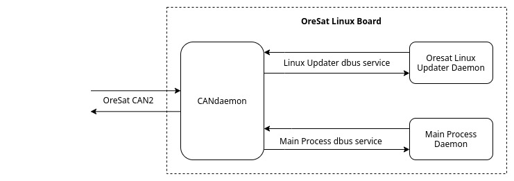

# OreSat-Linux
This repo has all the general design and code for all 4 linux boards on OreSat. The four boards being [GPS], [StarTracker], [OreSat Live], and Cirrus Flux Camera (CFC).

## Linux board

All A8 onboard OreSat will run 3 processes; the CANdaemon, the updater, and the main process. 

### CANdaemon
Acts a front end for all of OreSat Linux daemons. The CANdaemon allows the CAN Network Manger to control/get data from daemons on the Linux board. It will use DBus to interface with daemons.

### Linux updater
A daemon that allows the Linux board to be updated through *.deb packages.

### Main Process
See [GPS], [StarTracker], [OreSat Live], and/or Cirrus Flux Camera (CFC) repos. All these process will be daemonized and will be debian package.

## Repo Layout 
- **CANcli** - Source code for CANcli, a modular CANbus monitor we use for flatsat.
- **CANdaemon** - Source code for CANdaemon.
- **docs_and_examples** - Useful documentation and examples for general Linux stuff.
- **updater_onboard** - Source code for Linux updater that will live on the satellite.
- **updater_ground_station** - Source code for Linux updater that will interatact with the Ground Station that will build the updates.
- **useful_scipts** - Useful scripts when working on beaglebone black or pocket beagle.

<!-- Other oresat repos -->
[GPS]:https://github.com/oresat/oresat-gps-software
[StarTracker]:https://github.com/oresat/oresat-star-tracker
[OreSat Live]:https://github.com/oresat/oresat-dxwifi-software

<!-- Other repos -->
[CANopenSocket]:https://github.com/CANopenNode/CANopenSocket
