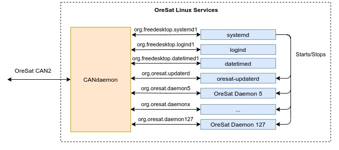

# OreSat Linux

This repo has all the general design and reasoning behind it for all the Linux boards on OreSat.
The current Linux boards being SDR GPS, Star Tracker, OreSat Live, and Cirrus Flux Camera (CFC).

## Why Linux?
Some of our systems need more computing power, so they're given a [Sitara AM335x] that can run Linux.

## General Board Design
All AM335x onboard OreSat will atleast have 3 services (aka daemons); the candaemon, the Linux updater, and the main service. 
OreSat uses [CAN] for commucation between systems onboard and follows the [CANopen] specifications.

### [oresat-linux-candaemon]
The candaemon acts a front end for all of OreSat Linux daemons and is build on top of [CANopenNode]. 
It allows the [C3], Oresat's CAN Network Manger, to control or get data from daemons on the Linux board. 
It uses [DBus] for inter-process communication with daemons. 
Basically the candaemon acts as a CANopen interface to all services needed to control the board over [DBus].
In other words, its a common service to convert CANopen message to DBus messsage and visa versa.

- systemd interface will allow [C3] board to turn on/off any service on the board.
- logind to provided power controls.
- datetimed allow the board time to be changed (useful for CANopen SYNC messages)
- any custom oresat daemon for the [C3] to control and get data from it.

See the [oresat-linux-candaemon] repo for more info.

### [oresat-linux-updater]
A simple daemon wrapper for apt that allows the Linux board to be updated over dbus using debian packages.
See the [oresat-linux-updater] repo for more info.

### OreSat Boards
See their software repo for how their spefic service works.
| Project               | Hardware                  | Software                                      |
|-----------------------|---------------------------|-----------------------------------------------|
| GPS / ADCS            | [oresat-gps-hardware]     | [oresat-gps-software], [oresat-adcs-software] |
| Star Tracker          | [oresat-star-tracker]     | [oresat-star-tracker-software]                |
| OreSat Live           | [oresat-dxwifi-hardware]  | [oresat-dxwifi-software]                      |
| Cirrus Flux Camera    | [oresat-cfc-hardware]     | TBD                                           |

<!-- OreSat repos -->
[oresat-adcs-software]:https://github.com/oresat/oresat-adcs-software
[oresat-gps-software]:https://github.com/oresat/oresat-gps-software
[oresat-gps-hardware]:https://github.com/oresat/oresat-gps-hardware
[oresat-star-tracker]:https://github.com/oresat/oresat-star-tracker
[oresat-star-tracker-software]:https://github.com/oresat/oresat-star-tracker-software
[oresat-dxwifi-hardware]:https://github.com/oresat/oresat-dxwifi-hardware
[oresat-dxwifi-software]:https://github.com/oresat/oresat-dxwifi-software
[oresat-cfc-hardware]:https://github.com/oresat/oresat-cfc-hardware
[oresat-linux-candaemon]:https://github.com/oresat/oresat-linux-candaemon
[oresat-linux-updater]:https://github.com/oresat/oresat-linux-updater
[C3]:https://github.com/oresat/oresat-c3

<!-- Other repos -->
[CANopenNode]:https://github.com/CANopenNode/CANopenNode

<!-- Other links -->
[CAN]:https://en.wikipedia.org/wiki/CAN_bus
[CANopen]:https://en.wikipedia.org/wiki/CANopen
[DBus]:https://en.wikipedia.org/wiki/D-Bus
[Sitara AM335x]:https://www.ti.com/processors/sitara-arm/am335x-cortex-a8/overview.html
