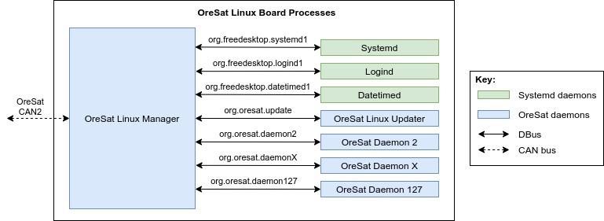

OLM (OreSat Linux Manager)
==========================

.. note::

   This is just a high level overview for OLM. For specifics, clone the
   `oresat-linux-manager`_ repo and build the Doxygen documentaton for it.

Background
----------
The communication bus on OreSat is a CAN bus. All board on OreSat follow the
CANopen spec and use the `CANopenNode`_ library. **Note** All OreSat board
follow the `CCSDS Time Code Format`_ (CCSDS 301.0-B-4), not the CANopen
specification.

CANopen specifications can be found at https://can-cia.org/groups/specifications/

Overview
--------

The OreSat Linux Manager is the front end interface to a Linux board over a 
CANbus for the `C3`_, Oresat's CANopen Network Manger, to use. It will allow
the `C3`_ to control OreSat daemons and it provides the interface for daemons
to put data onto object dictionary and on the on the CANbus. It uses 
`CANopenNode`_ for all CANopen protocols and uses `DBus`_ for inter-process 
communication with other daemons.

Every OreSat board will have it's own version as every board will have 
different OreSat daemons for OLM to interface to.

App system
----------
Every DBus interface will have it own app.

Apps will:

- Defines the interface between CANopen's Object Dicationary and a daemon DBus
  interface.
- Register OreSat daemons with the daemon controller.
- Register filename keywords with file transfer system, so OLM can move 
  all files written to the Linux board over CAN to the correct directory.

OreSat Daemon Control
---------------------

OLM connects to systemd `DBus`_ and provides a API to the Network Manager on 
the CAN bus. So in other words, OLM provides an API for `C3`_ to turn any
OreSat daemon on or off. It will on provide this option to only OreSat daemons
that are register, all non OreSat daemons cannot be control, and all OreSat 
daemons not registered will never be used. Supports up to 127 OreSat daemons.

File Transfer
-------------

OreSat Linux Manager supports both reading and writing files to the Linux board
over CAN. Files written to OLM must be properly format as the filename defines 
what OLM will do with it. There is a keyword field in the filenames. If the
keyword is not register with OLM, the file will be delete as OLM will not know
what to do with the file.

.. toctree::
    :maxdepth: 2

    ../standards/file-transfer

Power Saving
------------

To save on power, when only OLM is running, it will set the CPU frequency 
governor to powersave mode (300Mhz on AM335x), and when at least one 
OreSat dameon is running it will change the CPU frequency governor to 
performance mode (1GHz on AM335x).

Other features
--------------

- OLM can get a copy of journald system logs.
- It provides info about the Linux Board; ie disk usage, RAM usage, etc.
- Interfaces with logind to provided power controls (poweroff and reboot).
- Interfaces with datetimed allow the board time to be changed
  (useful for CANopen SYNC messages)
- Follows the `CCSDS Time Code Format`_ (CCSDS 301.0-B-4) standards.

.. OreSat repos
.. _C3: https://github.com/oresat/oresat-c3
.. _oresat-linux-manager: https://github.com/oresat/oresat-linux-manager
.. _oresat-linux-updater: https://github.com/oresat/oresat-linux-updater

.. Other repos
.. _CANopenNode: https://github.com/CANopenNode/CANopenNode

.. Other links
.. _CAN: https://en.wikipedia.org/wiki/CAN_bus
.. _CANopen: https://en.wikipedia.org/wiki/CANopen
.. _DBus: https://en.wikipedia.org/wiki/D-Bus
.. _CCSDS Time Code Format: https://public.ccsds.org/Pubs/301x0b4e1.pdf
