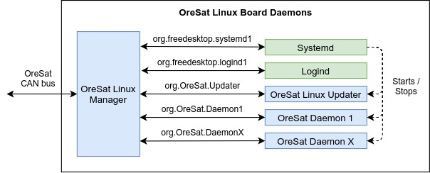

Software
========

In general, all OreSat software projects can be broken up into 3 category:

1. Kernel and firmware level

   Kernel modules and PRU firmware. Basically anything that deals with hardware.

2. Application level

   Software programs, mostly the backend daemon. The main program(s) for the
   board.

3. System level

   Anything dealing with the Debain image and the common applications that are
   on every Linux board (OLM and the OreSat Linux Updater).

All OreSat software will be put in a Debian package, so it can easily be
updated with the `oresat-linux-updater`_. Also, projects that use compiled 
langauges will have binary debian package (precompile) as the less compliling
on the satellite the better.

Linux Enviroment
----------------

All Linux boards will use the 4.19 TI Debian kernel as it has support for PRUs
on the `Octavo A8`_ from `TI`_ and `beagleboard`_.

Only `dpkg`_  will be used as a package manager. The goal is to avoid using
other package managers like `pip`_ as much as possible. It would be a pain to
deal with multiple package managers.

All networking will be handled by systemd-networkd. 

OLM (OreSat Linux Manager)
--------------------------

.. note::

   This is just a high level overview for OLM. For specifics, clone the
   `oresat-linux-manager`_ repo and build the Doxygen documentaton for it.

The OreSat Linux Manager is the front-end interface to a Linux board over a 
CAN bus for the `C3`_ to use. Unlike other OreSat daemon, OLM is always running
as it is the front-end to the board, so it is the most critial daemon on all
Linux board. If OLM stops, gets disable, or crashes the board is basically dead
to the `C3`_.

OLM has two main jobs:

1. To abstract the CAN bus away from the backend OreSat daemons.

    It uses D-Bus for all inter-processs communication to other daemons. It acts
    a D-Bus client to all backend dameons. 
   
    - Since OLM abstracts the CAN bus away from the backend daemons, backend
      daemons do not have to worry about CANopen protocols, so the backend 
      daemons can be written in any langauges that has a D-Bus library/bindings.
    - OLM can read the data from the backend daemons D-Bus server and put any
      data on CANbus.
    - OLM can send command to backend daemon(s) it received over the CAN bus
      allowing for direct communication to the backend daemons over the CAN
      bus.
    - Supports file transfer over a CAN bus.

2. To control and get info about the linux board it is on.

    - Interfaces with *systemd* to start and stop backend OreSat daemons.
    - Interfaces with *logind* to provided power controls (poweroff and reboot).
    - It provides info about the Linux Board; ie disk usage, RAM usage, etc.
    - Allow local time to be set based off of CANopen messages.
    - Power saving. Adjusts the CPU frequency depending on any of backend
      OreSat daemons are running or not.
    - Can run bash commands sent over a CAN bus.

Also, OLM is configurable, so every board will have its own unique version 
(OLM core will be the same). Every board will not only have a unique Object
Dicationary, but also have different backend OreSat daemons for that version
of OLM to interface to and control.

OreSat Linux Updater
--------------------

.. note::

   This is just a high level overview for OreSat Linux Updater. For specifics see 
   https://oresat-linux.readthedocs.io/projects/oresat-linux-updater/en/latest/index.html

Basicily it's a simple daemon wrapper for on top of `dpkg`_ that allows the Linux
board to be updated over dbus using local Debian packages sent to the Linux board.
It also support running bash scipts, but all updates should be done with deb
packages. 

OreSat Linux boards are updated with standardized update tarfiles. Updates will
contain deb files, bash scripts, and a *instructions.txt* file. The
*instructions.txt* will define the order deb packages are installed, deb
package are removed, and bash scripts are ran in.

The OreSat Linux Updater can also provides a tar with a txt file with a list of
update tarfiles cached and a copy of the dpkg status file. Both the list of
update tarfiles and dpkg status file will be used to make future updates. 

Daemons
-------

There is no human user to start an applications/programs when the board is
powered on, so all OreSat applications/programs will be a daemon (aka Linux
Service) so it can be control with systemd. The `oresat-linux-manager`_ will
use systemd to start or stop OreSat daemons as command by the `C3`_ board.

OreSat deamon service files follow naming scheme of oresat-<name>d.service,
e.g. oresat-gpsd.service.

Daemons should log to syslog (journald will grab those logs), so if the logs
are needed OLM can easily copy them and give them to the `C3`_.

All OreSat daemon except OLM will have a D-Bus server for inter-process 
communications. All OreSat daemons will use system dbus. The dbus config file
naming format should be org.OreSat.<service>, e.g. org.OreSat.StarTracker.

**D-Bus Library recomendataions**

- For C or C++ use `sd-bus`_ as it is the dbus library as it is built into 
  systemd.
- For modern C++ (>= C++11) use `sdbus-cpp`_ as it is a nice modern C++ wrapper
  ontop of `sd-bus`_.
- For Python3 use `pydbus`_ as it is easy to use.
- For others? A list of supported dbus library for other langauges can be found
  at `freedesktop dbus bindings`_

Kernel Modules
--------------

All OreSat Linux kernel module use `DKMS`_ as it will make installing and
packaging kernel module easier. Also, it's nice to no worry about updating
kernel modules if the kernel needs to be updated.

.. OreSat repos
.. _C3: https://github.com/oresat/oresat-c3
.. _oresat-linux-manager: https://github.com/oresat/oresat-linux-manager
.. _oresat-linux-updater: https://github.com/oresat/oresat-linux-updater

.. Other repos
.. _CANopenNode: https://github.com/CANopenNode/CANopenNode
.. _sd-bus: https://github.com/systemd/systemd/blob/master/src/systemd/sd-bus
.. _sdbus-cpp: https://github.com/Kistler-Group/sdbus-cpp/
.. _pydbus: https://github.com/LEW21/pydbus
.. _DKMS: https://github.com/dell/dkms

.. Other links
.. _dpkg: https://www.dpkg.org/
.. _pip: https://pypi.org/project/pip/
.. _TI: https://www.ti.com/processors/sitara-arm/am335x-cortex-a8/overview.html
.. _Octavo A8: https://octavosystems.com/octavo_products/osd335x-sm/
.. _D-Bus: https://en.wikipedia.org/wiki/D-Bus
.. _freedesktop dbus bindings: https://www.freedesktop.org/wiki/Software/DBusBindings/
.. _beagleboard: https://beagleboard.org/
.. _CCSDS Time Code Format: https://public.ccsds.org/Pubs/301x0b4e1.pdf
