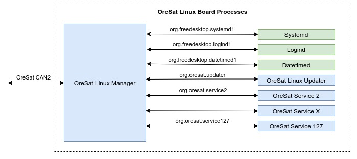

OLM (OreSat Linux Manager)
==========================

Background
----------
The communication bus on OreSat is a CAN bus. All board on OreSat follow the
CANopen spec and use the `CANopenNode`_ library. **Note** All OreSat board
follow the `CCSDS Time Code Format`_ (CCSDS 301.0-B-4), not the CANopen
specification.

CANopen specifications can be found at https://can-cia.org/groups/specifications/

Overview
--------

.. note::

   This is just a high level overview for OLM. For specifics, clone the
   `oresat-linux-manager`_ repo and build the Doxygen documentaton for it.

The manager acts a front end for all of OreSat Linux daemons and is build on
top of `CANopenNode`_.  It allows the `C3`_, Oresat's CAN Network Manger, to
control or get data from daemons on the Linux board. It uses `DBus`_ for
inter-process communication with daemons.  Basically the manager acts as a
CANopen interface to all services needed to control the board over `DBus`_.
In other words, its a common service to convert CANopen message to DBus
messsage and visa versa.

App system
----------
Every DBus interface will have it own app.
A app will:

- Register OreSat daemon with the daemon controller,
- Provides the interface for getting data to and from any daemon over DBus.

OreSat Daemon Control
---------------------

OLM connects to systemd DBus and provides a API to the Network Manager on the
CAN bus.So in other words, OLM provides an API for `C3`_ to turn any OreSat
service on or off. It will on provide this option to only OreSat services
that are register, all non OreSat services can not be control, and all OreSat
services not registered will never be used. Supports up to 126 OreSat services.

File Transfer
-------------

OreSat Linux Manager supports both reading and writing files to the linux board
over CAN. Filename must be properly format otherwise OLM will delete them. The
formatting should make all file read to and written from Linux board to have
unique filenames.

Power Saving
------------

To save on power, when only OLM is running, it will set the CPU frequency to
powersave mode (300Mhz on AM335x), and when atleast one OreSat dameon is running
it will change the CPU frequency to performance (1GHz on AM335X).

Other features
--------------

- Provides info about the Linux Board; ie disk usage, RAM usage, etc.
- Interfaces with logind to provided power controls (poweroff and reboot).
- Interfaces with datetimed allow the board time to be changed
  (useful for CANopen SYNC messages)
- Follows the `CCSDS Time Code Format`_ (CCSDS 301.0-B-4) standards.

.. OreSat repos
.. _C3: https://github.com/oresat/oresat-c3
.. _oresat-linux-manager: https://github.com/oresat/oresat-linux-manager
.. _oresat-linux-updater: https://github.com/oresat/oresat-linux-updater

.. Other repos
.. _CANopenNode: https://github.com/CANopenNode/CANopenNode

.. Other links
.. _CAN: https://en.wikipedia.org/wiki/CAN_bus
.. _CANopen: https://en.wikipedia.org/wiki/CANopen
.. _DBus: https://en.wikipedia.org/wiki/D-Bus
.. _CCSDS Time Code Format: https://public.ccsds.org/Pubs/301x0b4e1.pdf
