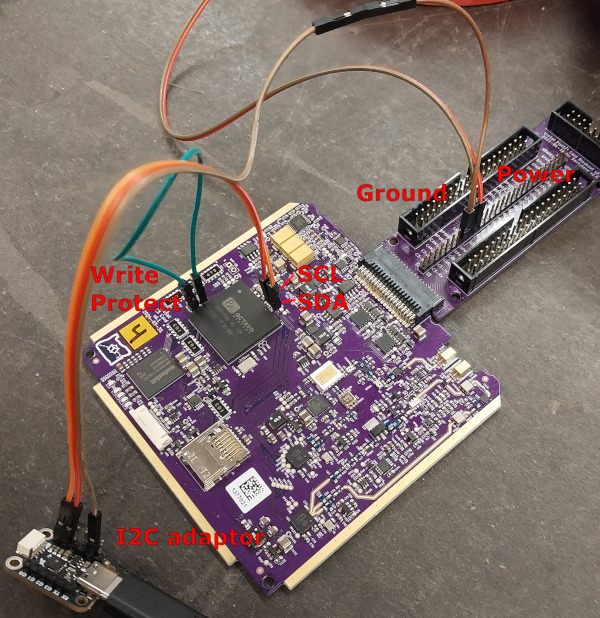
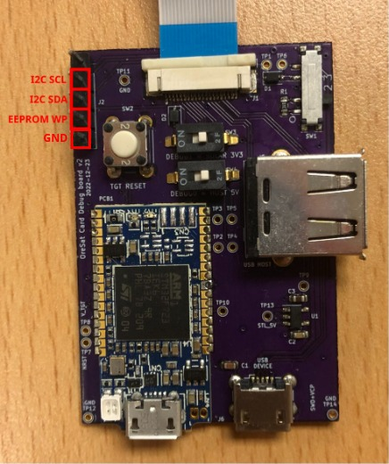

# Octavo EEPROM Flasher

This script will write an ID value to the Octavo's EEPROM. When the Octavo is
booting, U-Boot will read the EEPROM value to figure out what device
tree to load, before booting up Linux.

The IDs are based on those of the PocketBeagle which can be
[found here](https://github.com/beagleboard/image-builder). The older OreSat0.5
images will need the ID set to either PocketBeagle or BeagleBone for its U-Boot
to recognize it but the newer OreSat1 images will recognize the appropriate
OreSat card ID.

## Requirements

A laptop with Python and a USB-I2C adapter such as this
[MCP2221 breakout](https://www.adafruit.com/product/4471). Check the Programmer
drawer in the Rocket Room for the bag labeled "Octavo EEPROM Programmer", that
has a kit with all the necessary equipment.

## Setup

Clone the oresat-linux repo:

```bash
$ git clone https://github.com/oresat/oresat-linux
$ cd oresat-linux/octavo_eeprom_flasher
```

Install dependencies:

```bash
$ pip install .
```
Alternatively due to permissions either you'll need to run this script as root
or create a udev rule that grants your user permission to access the I2C
peripheral. If you run this as root you'll want the package `python3-periphery`
instead:

```bash
$ sudo apt install python3-periphery
```

## Writing to the EEPROM

Connect the adaptor I2C and ground pins to the Octavo’s I2C-0
and the breakout board ground, and short the write protect pins if
intending to write an ID. See your board's KiCad schematic for more.



**WARNING**: For the GPS v1.0 and the Star Tracker v1.2 (and older versions of
those cards) used the debug card to break out I2C-0 pins as shown below. **For
every other card or newer version of those cards**, see the KiCad/Eagle
schematic to find the pins.



Power on the Octavo.

Find which `/dev/i2c-n` device your adapter is. The `i2cdetect -l` utility from
the `i2c-tools` package will be helpful. If there are no `/dev/i2c-n` devices
you may have to load the `i2-hid` kernel module: `sudo modprobe i2c-hid`.

**WARNING**: Picking the wrong `/dev/i2c-n` may damage your host computer. Make
sure you are using the correct one.

Run the `eeprom.py` script (use `-h`/`--help` see args).

Example: Flash info for a v6.0 C3 card #1:

    ./eeprom.py write /dev/i2c-n c3 6.0 1

Example: Read the EEPROM ID:

    ./eeprom.py read /dev/i2c-n

`read` can be helpful for testing if you've connected the hardware correctly.
