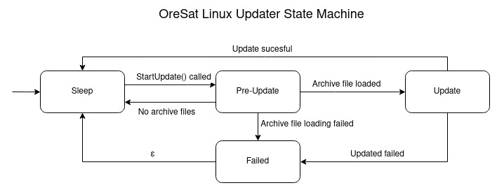

# OreSat Linux Updater
This is a daemon available on on all OreSat Linux board and will allow any the board to update/patched through a archive files.
The archive file can contain *.deb packages to install, remove.txt (a file with list of deb packages to remove), and bash scripts to run.
It is controlled through a dbus interface.

## Repo layout
- **debian_pkg_maker/** - Scripts / files to make debian package.
    - **deb-pkg-files/** - Contents of data.tar.gz in oresat-linux-updater *.deb file.
        - **control** - Contents of `apt show oresat-linux-updater`.
        - **postinst** - post install file for debian package.
        - **postrm** -  post remove file for debian package.
        - **preinst** - pre install file for debian package.
        - **prerm** - pre remove file for debian package.
    - **make-deb-package.sh** - Make oresat-linux-updater *.deb file.
    - **oresat-linux-updaterd.service** - systemd daemon service file used in *.deb file.
- **docs** - Documention.
- **src/** - python3 source code.
    - **updater.py** - The main controller class handling the states.
    - **updater_apt.py** - python3-apt Wrapper class.
    - **updater_dbus.py** - Dbus wrapper for updater.py.
    - **updater_main.py** - The main for project, has daemonizing code.
    - **updater_state_machine.py** - Simple class to handle state transitions.
- **test/** - Test scripts source file. TODO
    - **test-client.py** - TODO
- **install-daemon.sh** - Install oresat-linux-updeter in /opt/.
- **oresat-linux-updaterd.service** - systemd daemon service file for install-daemon.sh.
- **org.OreSat.LinuxUpdater.conf** - systemd dbus config file.
- **README.md** - README.

## Dependacies
- `sudo apt install python3 python3-pydbus python3-apt`

## How it works
### Directories and files
- **oresat-linux-updater/** - Main directory for all of oresat-linux-updater directories / files.
    - **working/** - Directory for when StartUpdate() is called the oldest archive file (if one exist) contents are put in it and process.
    - **cache/** - Directory for holding archives.
    - **apt_list_file.txt** - A file with content of `apt list --installed`. It is made in Pre-Update state, used for reverting. Can get a copy with AptListOuput() dbus method. On boot up, if this file exist and revert.txt does not exist, the updater will resume an update with the contents of the working directory.
    - **revert.txt** - A file to mark reverting is / has happened. On boot up of the oresat-linux-updater this file will be used to figure out if what state to go to in boot up. If it contains "inprocess", the updater was stop in the middle of an update, therefor resume a revert. If it contains "failed", the revert failed, goto failed on boot. If it doesn't exist, it was not reverting, check for apt_list_file.txt. 

### States Machine

- **Sleep** - Waiting, listening for commands.
- **Pre-Update** - If there are archive files available in cache, the updater will open the oldest one and dump its contents in the working directory.
- **Update** - Install all deb packages, remove deb package as remove.txt says, and run all bash scripts in working directory. Clean up working directory on success.
- **Revert** - Delete all the files in cache and working directory, uses the apt_list_file.txt file to revert back to to before the failed update. 
- **Failed** - Pre-Update or Revert failed, waiting for a fix with ForceUpdate(). 

### Dbus methods
| Name              | Usage                                                     | Inputs    | Output    |
| :---------------: | :-------------------------------------------------------: | :-------: | :-------: | 
| StartUpdated()    | Starts the update, if there is archive file available.    | -         | Boolean   |
| ForceUpdate()     | Starts an update immediately with archive file input.     | String    | Boolean   |
| AddArchiveFile()  | Add new archive file to queue.                            | String    | Boolean   |
| AptListOutput()   | Async request for apt_list_file.txt.                      | -         | Boolean   |

### Dbus properties
| Name                  | Usage                                             | Datatype  | Read/Write    |
| :-------------------: | :-----------------------------------------------: | :-------: | :-----------: |
| Status                | Current state of Linux Updater.                   | Int32     | Readonly      |
| CurrentArchiveFile    | The name of current file being installed.         | String    | Readonly      |
| AvailableArchiveFiles | Number of archive file available.                 | Uint32    | Readonly      |

## Usage
- `python3 src/updater_main.py` To run as a process
- `python3 src/updater_main.py -d` To run as a daemon
- `python3 src/updater_main.py -h` For help output

## Building Debian images
- Only works on a Debian as it requires dpkg.
- `bash debian_pkg_maker/make-deb-package.sh`

