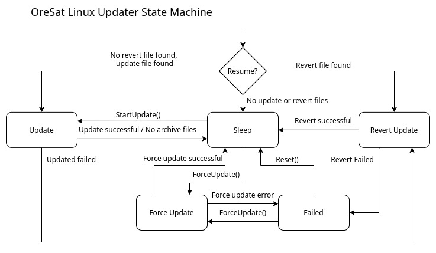

# OreSat Linux Updater
This is daemon (oresat-linux-updaterd) is available on on all OreSat Linux boards and it allows the board to be updated/patched. 
The Updater can handle install debian packages, remove debian packages, and running bash scripts as needed.
The Updater daemon can be controlled through it dbus interface.
Archive files can be send to the Linux Updater through the dbus interface.
Archive files will contain *.deb packages, bash scripts, and a yaml instruction file.

## Dependacies
- python3, python3-yaml, python3-pydbus, python3-apt

### Dbus methods
| Name              | Usage                                                     | Inputs    | Output    |
| :---------------: | :-------------------------------------------------------: | :-------: | :-------: | 
| StartUpdated()    | Starts the update, if there is archive file available.    | -         | Boolean   |
| ForceUpdated()    | Starts the update imminent with new archive file.         | String    | Boolean   |
| AddArchiveFile()  | Add new archive file to queue.                            | String    | Boolean   |
| AptListOutput()   | Request the output of "apt list --installed".             | -         | Boolean   |

### Dbus properties
| Name                  | Usage                                             | Datatype  | Read/Write    |
| :-------------------: | :-----------------------------------------------: | :-------: | :-----------: |
| CurrentStatus         | Current state of Linux Updater.                   | Int32     | Readonly      |
| CurrentArchiveFile    | The name of current file being installed.         | String    | Readonly      |
| AvailableArchiveFiles | Number of archive file available.                 | Uint32    | Readonly      |

### States Machine

- **Sleep** - Initial state that will be listening for commands.
- **Pre-Update** - If there are archive files available, the updater will uncompress/open the oldest one.
- **Update** - Load and parses the yaml instrution file to install/remove deb packages and run bash scripts as the instructions say to do.
- **Revert** - Reverts the failed update, deletes archive cache as it is assumes all updates depend on the previous update.
- **Failed** - Linux Updater is broken; an update or revert failed.

